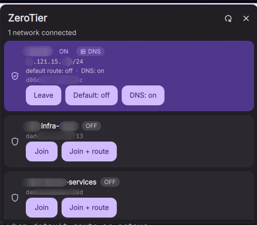
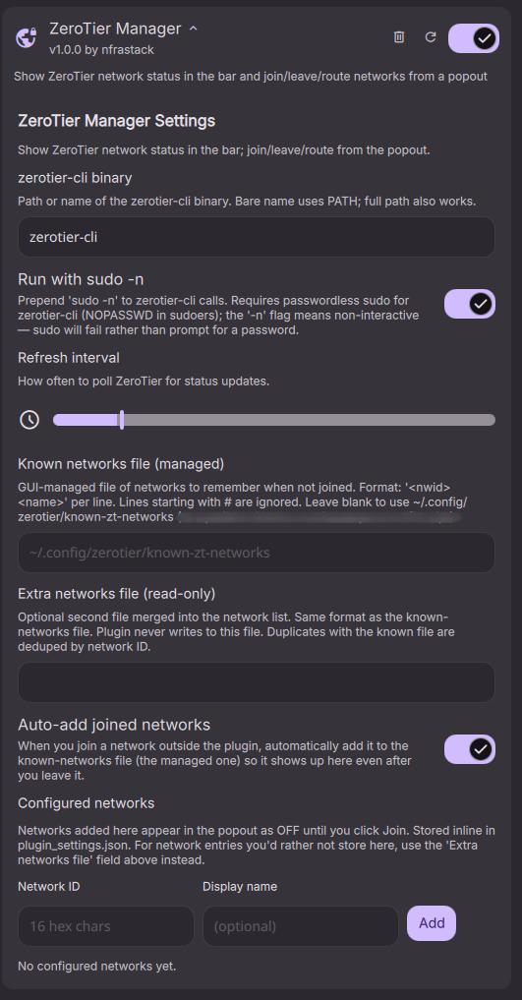

# nfrastack/dms-zerotierManager

## About

ZeroTier Manager is a DankMaterialShell (DMS) bar widget that shows ZeroTier network status and provides quick actions to join, leave, and toggle default-route routing for networks from a compact popout.

## Features

- Bar pill summarizing overall state (no networks / joined / routing)
- Popout listing joined and known networks with per-network actions: Join, Leave, Enable/Disable default route, Enable/Disable DNS
- Auto-add networks you join externally to a managed known-networks file
- Support for a read-only extra networks file and inline configured networks
- Non-blocking background polling; actions run via configurable `zerotier-cli` invocation (optionally with `sudo -n`)

## Maintainer

- [Nfrastack](mailto:code@nfrastack.com)

## Table of Contents

- [About](#about)
- [Features](#features)
- [Maintainer](#maintainer)
- [Screenshots](#screenshots)
- [Requirements](#requirements)
- [Installation](#installation)
- [Configuration](#configuration)
- [Usage](#usage)
- [Permissions](#permissions)
- [Troubleshooting](#troubleshooting)
- [Support & Maintenance](#support--maintenance)
- [License](#license)

## Screenshots





## Requirements

- This plugin requires DMS >= 0.3.0 (see `plugin.json`).
- `zerotier-one` (daemon) running on the host
- `zerotier-cli` available (either on PATH or set via plugin settings)
- `ip` command (used to detect default-route state)
- Optional: passwordless sudo for `zerotier-cli` if you enable the "Run with sudo -n" setting

Example sudoers line

```text
%zerotier ALL=(root) NOPASSWD: /usr/sbin/zerotier-cli
```

## Installation

Install the plugin into your DMS plugins directory and reload DMS:

```bash
mkdir -p ~/.config/DankMaterialShell/plugins/
git clone github.com/nfrastack/zerotierManager ~/.config/DankMaterialShell/plugins/zerotierManager
```

## Configuration

Open the plugin settings in DMS (Settings → Plugins → ZeroTier Manager) or edit `plugin_settings.json` for these keys:

| Key | Type | Description | Default |
| --- | ---- | ----------- | ------- |
| `zerotierBinary` | string | Binary name or absolute path. | `zerotier-cli` |
| `useSudo` | bool | Prepend `sudo -n` to calls (non-interactive). | `true` |
| `refreshInterval` | integer (seconds) | Poll cadence for status. | `5` |
| `knownNetworksFile` | string | Managed file the plugin writes to. | `~/.config/zerotier/known-zt-networks` |
| `extraNetworksFile` | string | Read-only file merged into the list (plugin does not write). | `""` |
| `autoAdd` | bool | Automatically append externally-joined networks to the known file. | `true` |
| `configuredNetworks` | array | List of `{ nwid, name }` entries stored inline and shown as OFF until joined. | `[]` |

Known/external networks file format:

```text
# Each non-comment line: <network-id> <display name> <system>
# lines beginning with # are ignored
24b2f1a2c3d4e5f0 My-ZT-Network
```

>> Add manually "system" as the third argument to always connect

## Usage

- Bar pill states:
  - Daemon unreachable / no networks: dim pill, shield/lock icon
  - ≥1 network joined: tinted pill, verified_user/key icon with count badge
  - Default-route active: accent pill, router icon

- Tooltip shows joined network names or `ROUTING: <name> via <gateway>` when default-route is active.

- Popout behavior:
  - Joined networks are shown first; known-but-not-joined appear below.
  - Actions per row:
    - Joined: `Leave`, `Enable default` / `Disable default`, `Enable DNS` / `Disable DNS`
    - Not joined: `Join`, `Join + route`

Actions are executed via the configured `zerotier-cli` invocation. When `useSudo` is enabled, commands are prefixed with `sudo -n` (non-interactive sudo).

## Permissions

The plugin requests these permissions:

- `settings_read` — read plugin configurations
- `settings_write` — save plugin configurations
- `process` — run the helper commands to query and manage ZeroTier

## Troubleshooting

- "Daemon unreachable": ensure `zerotier-one` is running and the `zerotier-cli` path is correct.
- "sudo -n failed": if you enabled `useSudo`, ensure passwordless sudo is configured for the `zerotier-cli` binary; otherwise disable `useSudo`.
- If the network list appears empty but the daemon is running, check permissions and that `ip` is available.

## Support & Maintenance

- For community help, tips, and community discussions, visit the [Discussions board](../../discussions).
- For personalized support or a support agreement, see [Nfrastack Support](https://nfrastack.com/).
- To report bugs, submit a [Bug Report](issues/new). Usage questions may be closed as not-a-bug.
- Feature requests are welcome, but not guaranteed. For prioritized development, consider a support agreement.
- Updates are best-effort, with priority given to active production use and support agreements.

## License

MIT. See the project `LICENSE` for details.
